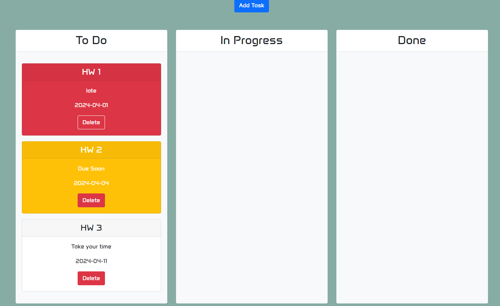

# Interactive Task Board

## Description

This application allows a user to input a task name, task due date, and task description. It uses the day.js function to enable the card to change its warning color based on how late a task is. A user can then move task cards into 3 input fields; to do, in progress, and done. Once the user deems the task card no longer needed, they will be able to delete the card off the webpage. 

[https://cnm724.github.io/interctiveTaskBoard/](https://cnm724.github.io/interctiveTaskBoard/)

[Github Page: https://github.com/cnm724/interctiveTaskBoard](https://github.com/cnm724/interctiveTaskBoard)

## Usage

modal

tasks with showcasing due dates 

draggable/droppable feature 
    

## Credits

* https://getbootstrap.com/docs/5.3/components/modal/#how-it-works -modal in html
* AI's xpert and gemini - helpful suggestions and resources
* Vinnie (tutor) - collaborated on js code

## License

MIT License
